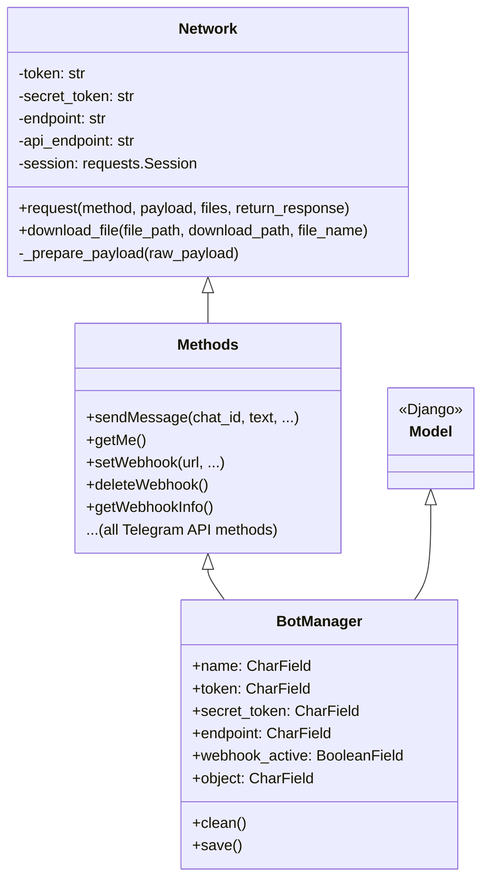

# Architecture

## Inheritance Chain

Monogram’s core behavior is defined by a single inheritance chain:

**Network → Methods → BotManager**

Each layer adds responsibility: **Network** handles HTTP and low-level API calls, **Methods** implements Telegram API methods, and **BotManager** adds Django persistence and makes each bot a first-class model instance.

---

## Hierarchy Diagram



---

## Layer Responsibilities

### 1. Network (`network.py`)

**Role**: HTTP client for the Telegram API.

- Holds `token`, `endpoint`, `secret_token`, and optional proxy settings.
- Builds the API base URL: `https://{endpoint}/bot{token}/`.
- Exposes `request(method, payload, files, return_response)` to send POST requests to a method path (e.g. `sendMessage`) and return the JSON `result` (or the raw response when needed).
- Handles payload cleanup: strips `None`, applies text formatting for `text`/`caption`, and optionally passes `files` for multipart uploads.
- Provides `download_file()` for getting files from Telegram by `file_path`.

All Telegram calls go through this layer, so logging, retries, and proxy configuration live in one place.

### 2. Methods (`methods.py`)

**Role**: Typography layer—one Python method per Telegram API method.

- Inherits from `Network` and calls `self.request(...)` for each API method.
- Each method (e.g. `sendMessage`, `getMe`, `setWebhook`) builds the correct payload and, when appropriate, maps the API result to a `monoTypes` class (e.g. `Message`, `User`).

Example from the codebase:

```python
class Methods(Network):
    def __init__(self, token, secret_token, endpoint, proxy, proxy_url):
        super().__init__(token=token, secret_token=secret_token, endpoint=endpoint,
                         proxy=proxy, proxy_url=proxy_url)

    def sendMessage(self, chat_id, text, parse_mode='html', reply_markup=None,
                    return_response=True, **kwargs):
        payload = {
            'chat_id': chat_id,
            'text': format_text(text),
            'parse_mode': parse_mode,
            'reply_markup': reply_markup,
            **kwargs
        }
        clean_payload = self._prepare_payload(payload)
        # ...
        result = self.request(method="sendMessage", payload=clean_payload,
                              return_response=return_response)
        return Message(**result)
```

So any class that inherits from `Methods` gets the full Telegram API surface and typed return values where defined.

### 3. BotManager (`models.py`)

**Role**: Django model that is also a Methods client.

- Declared as `class BotManager(Methods, models.Model)`.
- Adds DB fields: `name`, `username`, `owner`, `token`, `secret_token`, `endpoint`, `proxy`, `proxy_url`, `webhook_active`, `object`, timestamps, etc.
- In `__init__`, initializes `models.Model` first so fields exist, then initializes `Methods` with the model’s token, secret_token, endpoint, proxy, and proxy_url.
- In `save()`, after `full_clean()` and persisting, reinitializes `Methods` with the current credentials so the in-memory instance always matches the stored config.
- Optional `clean()` logic can validate token (e.g. with `get_me()`) when the token is changed.

Because `BotManager` subclasses `Methods`, every instance has all Methods (and thus Network) behavior. There is no separate client object; the model instance is the client.

---

## Calling `bot_instance.sendMessage()` Directly

1. **Get a bot instance** (from DB or in-memory):
   ```python
   bot = BotManager.objects.get(name='MyBot')
   ```
2. **Use it as a Telegram client**: `BotManager` inherits from `Methods`, and `Methods` defines `sendMessage`. So `bot.sendMessage(...)` is the same method.
3. **Execution path**:
   - `bot.sendMessage(chat_id=123, text='Hi')` is called.
   - `Methods.sendMessage` builds the payload and calls `self.request("sendMessage", payload, ...)`.
   - `Network.request` POSTs to `https://{endpoint}/bot{token}/sendMessage` and returns the result.
   - `sendMessage` then wraps the result in `Message(**result)` and returns a typed `Message` object.

So "direct" means: no wrappers, no separate client reference—just use the Django model instance as the bot API client. The same applies to `get_me()`, `setWebhook()`, and every other method defined on `Methods`.

---

## Summary

| Layer        | File        | Purpose |
|-------------|-------------|---------|
| **Network** | `network.py` | HTTP, session, request/response, file download |
| **Methods** | `methods.py` | Telegram API methods and typed returns |
| **BotManager** | `models.py` | Django model + Methods; one bot = one model instance |

This architecture keeps transport (Network), API shape (Methods), and persistence (BotManager) clearly separated while allowing developers to work with a single object: `bot_instance.sendMessage(...)` and the rest of the Telegram API directly on the bot model.
